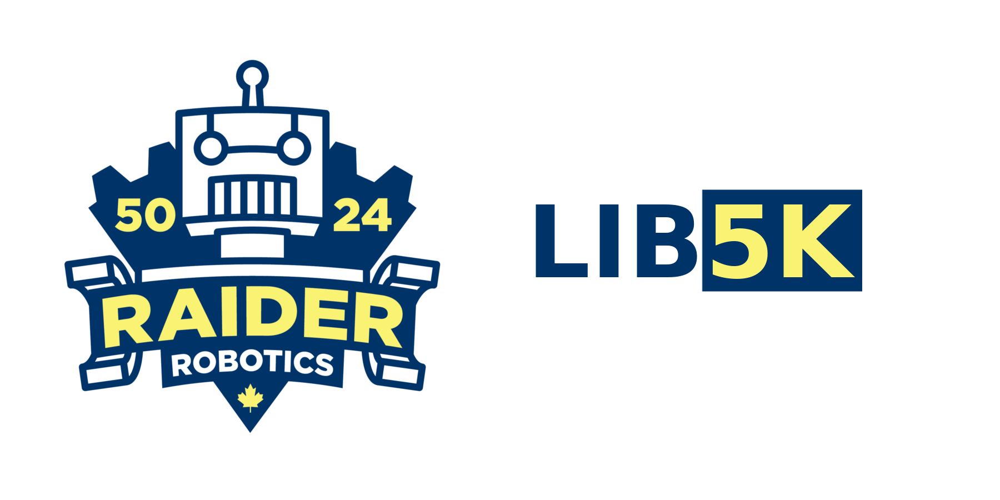

<!-- Badges go here -->

Lib5K is a robotics software library built and maintained by [Raider Robotics](https://github.com/frc5024), and is used by FRC teams world-wide. This library has two primary goals:
 - Support our fast-paced design and development workflow
 - Allow anyone from inexperienced programmers to mentors to experiment with advanced robotics control theory and tooling

Raider Robotics is committed to keeping this library open source, supported, and free to use. This way, if you see one of our robots do something cool, you can come and take a look at the code that powers it (and even use it for yourself). Being built on top of the [WPILib](https://github.com/wpilibsuite/allwpilib/) project, Lib5K is one of the largest Java robotics libraries available for the FIRST Robotics Competition. 

## More information

In an effort to keep our documentation centeralized and clean, everything you should need to know is stored in [the project's wiki](https://frc5024.github.io/lib5k). If you have any questions, or encounter any bugs, [open an issue](https://github.com/frc5024/lib5k/issues/new/choose) via our issue tracker.

## Sponsorships

Development of Lib5K is funded by our amazing sponsors. If you are interested in sponsoring this project and our team, [contact us](mailto:bealrobotics@gmail.com).

<!-- Sponsor banners -->

We would also like to thank every mentor who has been involved in software development at Raider Robotics:

 - [John Lownie](https://github.com/johnlownie)
 - [Matt Sterner](https://github.com/Mattster092)
 - [Michael Feeney](https://github.com/LordMichaelmort)
 - [Michael Harwood](https://github.com/salamander2)
 - [Warren Pratten](https://github.com/awpratten)